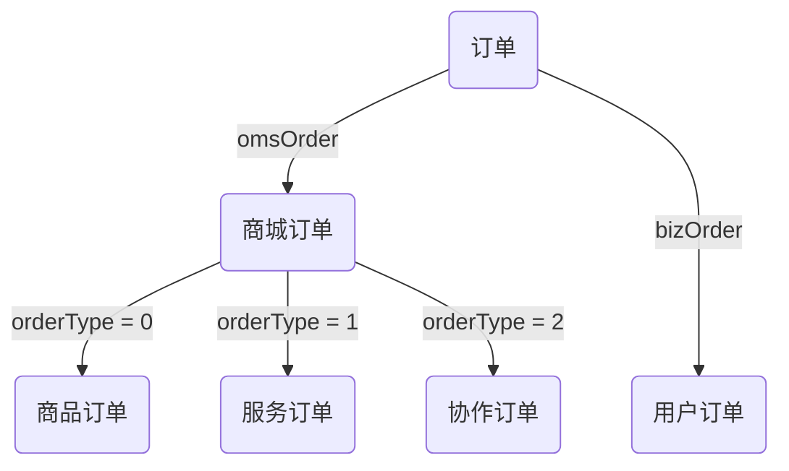

## 订单类型

## 订单状态

商城订单 - 订单状态 - status
| 值 | 商品订单 | 服务订单 | 协作订单 |
|----|----------|----------|----------|
| 0 | 待付款 | 待付款 | 待付款 |
| 1 | 待发货 | 待确认 | 待确认 |
| 2 | 已发货 | 服务中 | 服务中 |
| 3 | —— | 待验收 | 待验收 |
| 4 | 已完成 | 已完成 | 已完成 |
| 5 | 待售后 | 待售后 | 待售后 |
| 6 | 售后中 | 售后中 | 售后中 |
| 7 | 已关闭 | 已关闭 | 已关闭 |
| 8 | 退款 | 退款 | 退款 |
| 9 | 退货 | 退货 | 退货 |
| 10 | 无效订单 | 无效订单 | 无效订单 |

服务订单 - 指派类型 - assignType
| 值 | 说明 |
|----|--------|
| 0 | 未指派 |
| 1 | 指派 |
| 2 | 抢单 |

服务订单 - 指派状态 - assignStatus
| 值 | 说明 |
|----|--------------|
| 0 | 未指派 |
| 1 | 已指派待确认 |
| 2 | 已抢单待确认 |
| 3 | 已确认 |

用户订单 - 订单状态 - orderStatus
| 值 | 说明 |
|----|---------------|
| 10 | 待确认 |
| 15 | 已报价 |
| 20 | 已确认/待付款 |
| 30 | 服务中 |
| 35 | 待验收 |
| 40 | 待结算 |
| 50 | 已完成/待评价 |
| 51 | 已完成/已评价 |
| -1 | 已取消 |

用户订单 - 报价单状态 - bidStatus
| 值 | 说明 |
|----|----------------|
| 0 | 待确认 |
| 1 | 接单方取消 |
| 2 | 接单方确认 |
| 3 | 发单方确认 |
| 4 | 发单方拒绝 |
| 5 | 发单方取消订单 |
| 6 | 接单方取消订单 |
| 7 | 关闭订单 |
| 8 | 重新报价 |
