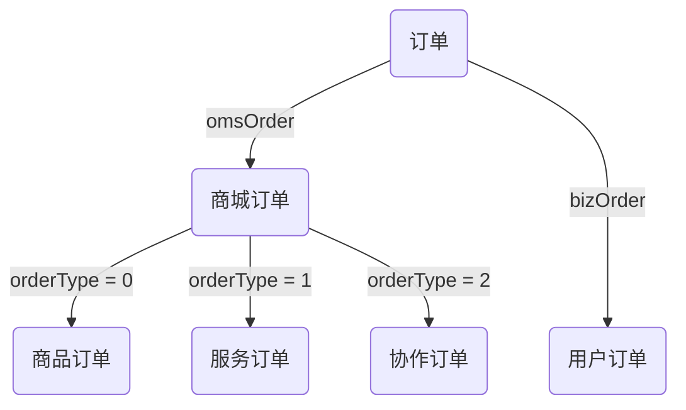

## 介绍


## 功能

``` sh
- 登录 / 注销

- 权限验证
  - 页面权限
  - 指令权限
  - 权限配置

- 多环境

- 多页配置

- 引导页

- 全局功能
  - 三种不同风格 layout 布局
  - 动态侧边栏（支持多级路由嵌套）
  - 动态面包屑
  - 快捷导航(标签页)
  - Svg Sprite 图标
  - 本地 mock 数据
  - Screenfull全屏
  - 自适应收缩侧边栏

- 功能组件
  - 图表
  - 图片预览
  - 按钮
  - 消息提示
  - 查询
  - 富文本编辑器
  - markdown编辑器
  - 弹窗
  - 显示更多
  - 详情组件
  - 二维码组件
  - 头像组
  - 文字高亮

- 表格
  - 基础表格
  - 分页表格
  - 带斑马纹表格
  - 带边框表格
  - 带状态表格
  - 固定表头
  - 固定列
  - 固定列和表头
  - 流体高度
  - 多级表头
  - 单选
  - 多选
  - 排序
  - 筛选
  - 展开行
  - 树形数据与懒加载
  - 自定义表头
  - 表尾合计行
  - 合并行或列
  - 自定义索引

- 自定义指令
  - Clipboard

- Hooks
  - UseWaterMark
  - UseScrollTo

- 多级菜单缓存

- 综合实例
  - 列表综合实例-弹窗
  - 列表综合实例-页面
```

## 前序准备

注意：本项目不支持低版本浏览器(如 ie)，后续会考虑支持IE11。

## 目录结构

``` sh
.
├── mock # 模拟数据
├── public # 静态资源
├── src # 项目代码
│   ├── assets # 静态资源
│   ├── cache # web-storage-cache配置
│   ├── components # 组件
│   ├── directive # 指令
│   ├── hooks # hooks
│   ├── libs  # 按需引入element-plus
│   ├── pages # 多页
│   │   └── index # index多页
│   │   │   ├── api # 全局api
│   │   │   ├── axios-config # axios配置
│   │   │   ├── layout # layout布局
│   │   │   ├── router # 路由配置
│   │   │   ├── store # 状态管理
│   │   │   ├── views # index多页 views 所有页面
│   │   │   ├── App.vue # 入口页面
│   │   │   ├── main.js # 入口文件 加载组件 初始化等
│   │   │   └── permission.js # 权限管理
│   ├── styles # 样式
│   ├── types # 全局types
│   ├── utils # 工具类
│   └── vue-bus # vueBus
├── tests # 测试
├── .env.xxx # 环境变量配置
├── .eslintrc.js # eslint 配置项
├── babel.config # babel配置文件
├── pages.config # 多页配置文件
├── postcss.config.js # postcss配置文件
├── package.json # package.json
├── vue.config # vue-cli 配置
└── yarn.lock
```
##路由配置
collapsed: false, # 菜单栏是否栏缩收
showLogo: true, # 是否显示logo
showTags: true, # 是否显示标签栏
showNavbar: true, # 是否显示navbar
fixedHeader: true, # 是否固定header
layout: 'Classic', # layout布局
showBreadcrumb: true, # 是否显示面包屑
showHamburger: true, # 是否显示侧边栏缩收按钮
showScreenfull: true, # 是否全屏按钮
showUserInfo: true, # 是否显示用户头像
title: 'vue-element-admin', # 标题
logoTitle: 'vue-ele-admin', # logo标题
userInfo: 'userInfo', # 登录信息存储字段-建议每个项目换一个字段，避免与其他项目冲突
greyMode: false, # 是否开始灰色模式，用于特殊悼念日
showBackTop: true # 是否显示回到顶部
##全局样式配置
// Silder
@menuText: #bfcbd9; # 侧边菜单默认字体颜色
@menuActiveText: #fff; # 侧边菜单选中字体颜色
@menuActiveBg: #2d8cf0; # 侧边菜单选中背景颜色

@menuBg: #001529; # 侧边菜单默认背景颜色

@subMenuBg: #1f2d3d; # 侧边菜单子菜单背景颜色
@subMenuHover: #2d8cf0; # 侧边菜单子菜单悬停背景颜色
@subMenuActiveText: #fff; # 侧边菜单子菜单悬停字体颜色

@menuWidth: 200px; # 侧边菜单宽度
@menuMinWidth: 64px; # 侧边菜单最小宽度

// topSider
@topSiderHeight: 60px; # 顶部操作栏高度

@topMenuText: #303133; # 顶部菜单栏目默认字体颜色
@topMenuActiveText: #2d8cf0; # 顶部菜单栏目选中字体颜色
@topMenuActiveBg: #fff; # 顶部菜单栏目选中背景颜色

@topMenuBg: #fff; # 顶部菜单栏目默认背景颜色

@topSubMenuBg: #1f2d3d; # 顶部菜单栏子菜单默认背景颜色
@topSMenuHover: #2d8cf0; # 顶部菜单栏子菜单悬停背景颜色
@topSMenuActiveText: #2d8cf0; # 顶部菜单栏子菜单悬停字体颜色

// navbar
@navbarHeight: 40px; # navbar高度

// tagsView
@tagsViewHeight: 40px; # 标签页高度
@tagActiveBg: #304156; # 标签页选中背景颜色

// content
@contentBg: #fff; # 主体内容背景颜色
@appBg: #f5f7f9; # 项目背景颜色

// html body
@minWidth: 992px; # 项目最小宽度

// the :export directive is the magic sauce for webpack
:export {
  menuText: @menuText;
  menuActiveText: @menuActiveText;
  menuActiveBg: @menuActiveBg;
  menuBg: @menuBg;
  subMenuBg: @subMenuBg;
  subMenuHover: @subMenuHover;
  menuWidth: @menuWidth;
  menuMinWidth: @menuMinWidth;
}

##侧边栏

路由配置和侧边栏
路由和侧边栏是组织起一个后台应用的关键骨架。

本项目侧边栏和路由是绑定在一起的，所以你只有在src/pages/index/router/index.ts下面配置对应的路由，侧边栏就能动态的生成了。大大减轻了手动重复编辑侧边栏的工作量。当然这样就需要在配置路由的时候遵循一些约定的规则。

#配置项
首先我们了解一下本项目配置路由时提供了哪些配置项。

redirect: noredirect        # 当设置 noredirect 的时候该路由在面包屑导航中不可被点击
name:'router-name'          # 设定路由的名字，一定要填写不然使用<keep-alive>时会出现各种问题
meta : {
  hidden: true              # 当设置 true 的时候该路由不会再侧边栏出现 如404，login等页面(默认 false)
  alwaysShow: true          # 当你一个路由下面的 children 声明的路由大于1个时，自动会变成嵌套的模式，
                            # 只有一个时，会将那个子路由当做根路由显示在侧边栏，
                            # 若你想不管路由下面的 children 声明的个数都显示你的根路由，
                            # 你可以设置 alwaysShow: true，这样它就会忽略之前定义的规则，
                            # 一直显示根路由(默认 false)
  title: 'title'            # 设置该路由在侧边栏和面包屑中展示的名字
  icon: 'svg-name'          # 设置该路由的图标
  noCache: true             # 如果设置为true，则不会被 <keep-alive> 缓存(默认 false)这里要注意 
                            #页面的vue文件的name要和路由的保持一致


  breadcrumb: false         # 如果设置为false，则不会在breadcrumb面包屑中显示(默认 true)
  affix: true               # 如果设置为true，则会一直固定在tag项中(默认 false)
  noTagsView: true          # 如果设置为true，则不会出现在tag中(默认 false)
  activeMenu: '/dashboard'  # 显示高亮的路由路径
  followAuth: '/dashboard'  # 跟随哪个路由进行权限过滤
  showMainRoute: true       # 设置为true即使hidden为true，也依然可以进行路由跳转(默认 false)
}
#路由
这里的路由分为两种，constantRoutes 和 asyncRoutes。

constantRoutes： 代表那些不需要动态判断权限的路由，如登录页、404、等通用页面。

asyncRoutes： 代表那些需求动态判断权限并通过 addRoutes 动态添加的页面。

#侧边栏
本项目侧边栏主要基于 element-plus 的 el-menu 改造。

侧边栏是通过读取路由并结合权限判断而动态生成的，而且还需要支持路由无限嵌套，所以这里还使用到了递归组件。

具体代码可查看src/components/Sider/index.vue

#多级目录(嵌套路由)
如果你的路由是多级目录，如本项目 @/pages/index/views/level 那样，有三级路由嵌套的情况下，不要忘记还要手动在二级目录的根文件下添加一个 <router-view />。

#面包屑
提示

本项目中也封装了一个面包屑导航，它也是通过 watch $route 变化动态生成的。它和 menu 也一样，也可以通过之前那些配置项控制一些路由在面包屑中的展现。大家也可以结合自己的业务需求增改这些自定义属性。比如可以在路由中声明breadcrumb:false，让其不在 breadcrumb 面包屑显示。

具体代码可以查看src/components/Breadcrumb/index.vue

#标签页
提示

本项目中每进行一次路由跳转，都会相应的把跳转的路由进行存储，进而在 标签页 中展示，让开发者可以快速的进行路由历史记录的操作。

组件具体代码可查看src/components/TagsView/index.vue

标签页过滤代码可查看src/pages/index/store/modules/tagsView.ts

#eslint
ESlint
#介绍
使用 lint 的好处

不管是多人合作还是个人项目，具备基本工程素养的同学都会注重编码规范，而代码风格检查（Code Linting，简称 Lint）是保障代码规范一致性的重要手段。

遵循相应的代码规范有以下好处

较少 bug 错误率
高效的开发效率
更高的可读性
#配置项
所有的配置文件都在.eslintrc.js中。 本项目基本规范是依托于 vue 官方的 eslint 规则 eslint-config-vue 做了少许的修改。大家可以按照自己的需求进行定制化配置。

比如：我个人或者项目组习惯于使用两个空格，但你可能觉得四个空格更顺眼，你可以做如下修改。 进入项目 .eslintrc.js 中，找到 indent，然后修改为 4 即可。 还有各种各样的配置信息，详情见 ESLint 文档。

默认情况下使用了最严格的plugin:vue/recommended来校验代码，若你觉得太严格可自行修改。

eslintrc.js

module.exports = {
  extends: ['plugin:vue/recommended', 'eslint:recommended']
  //你可以修改为  extends: ['plugin:vue/essential', 'eslint:recommended']
}
#取消 ESLint 校验
如果你不想使用 ESLint 校验（不推荐取消），只要找到 vue.config.js 文件。 进行如下设置 lintOnSave: false 即可。

#自动修复
运行如下命令，eslint 会自动修复一些简单的错误。

npm run lint -- --fix


#组件说明
##Echart-数据可视化展示组件
 一.参数
    1.className(类型)
    2.heigth(图表高度)
    3.width(图标高度)
    4.options(需要的其他参数)
    5.示例
        ```<echart :options="barEchatOptions" :height="'300px'" />```

##Editor-在线编辑器
 一.参数
    1.

##屏幕自适应
①行内如果写px单位的话是不会转换成rem的，
②如果使用UI库必须要在行内写样式大小的话，要转换为rem书写
③无需转换rem的可以写Px或者PX

sortablejs 注意事项 每次的实列化需要采用不同的class不然源码会做重复处理，细节见源码;

## el-image 组件的问题
>>在el-table中使用（table有选择功能时） el-image时组件的src不能由函数返回，必须采用组装字符串方式组装src，否则table选中时候组件重绘制，图片会闪烁
使用如下
  ```          <el-image
                preview-teleported
                style="height: 8rem; width: 8rem; margin: 0"
                :src="$imageGlobal + scope.row.coverImg"
                :preview-src-list="$getUrl.getPicUrl(scope.row.coverImg)"
              />   ```
## 订单类型


## 订单状态

商城订单 - 订单状态 - status
| 值 | 商品订单 | 服务订单 | 协作订单 |
|----|----------|----------|----------|
| 0  | 待付款   | 待付款   | 待付款   |
| 1  | 待发货   | 待确认   | 待确认   |
| 2  | 已发货   | 服务中   | 服务中   |
| 3  | ——       | 待验收   | 待验收   |
| 4  | 已完成   | 已完成   | 已完成   |
| 5  | 待售后   | 待售后   | 待售后   |
| 6  | 售后中   | 售后中   | 售后中   |
| 7  | 已关闭   | 已关闭   | 已关闭   |
| 8  | 退款     | 退款     | 退款     |
| 9  | 退货     | 退货     | 退货     |
| 10 | 无效订单 | 无效订单 | 无效订单 |

服务订单 - 指派类型 - assignType
| 值 | 说明   |
|----|--------|
| 0  | 未指派 |
| 1  | 指派   |
| 2  | 抢单   |

服务订单 - 指派状态 - assignStatus
| 值 | 说明         |
|----|--------------|
| 0  | 未指派       |
| 1  | 已指派待确认 |
| 2  | 已抢单待确认 |
| 3  | 已确认       |

用户订单 - 订单状态 - orderStatus
| 值 | 说明          |
|----|---------------|
| 10 | 待确认        |
| 15 | 已报价        |
| 20 | 已确认/待付款 |
| 30 | 服务中        |
| 35 | 待验收        |
| 40 | 待结算        |
| 50 | 已完成/待评价 |
| 51 | 已完成/已评价 |
| -1 | 已取消        |

用户订单 - 报价单状态 - bidStatus
| 值 | 说明           |
|----|----------------|
| 0  | 待确认         |
| 1  | 接单方取消报价     |
| 2  | 接单方确认报价    |
| 3  | 发单方确认报价     |
| 4  | 发单方拒绝报价     |
| 5  | 发单方取消订单 |
| 6  | 接单放取消订单 |
| 7  | 关闭订单       |
| 8  | 重新报价       |
